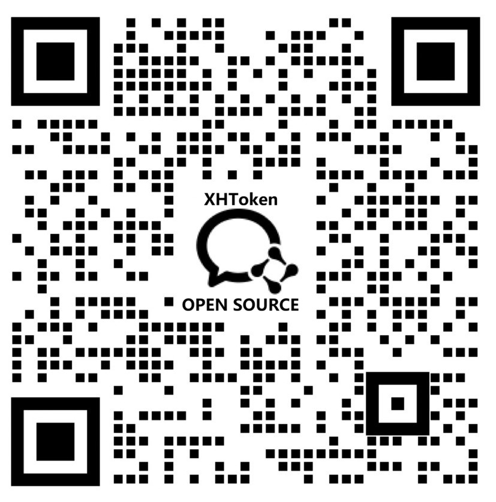

# XHToken Community

<!-- toc -->
- [Communicating](#communicating)
- [Contact](#contact)
- [Contribute](#contribute)
- [Membership](#membership)
- [Governance &amp; Policies](#governance--policies)
<!-- /toc -->

Welcome to the XHToken Community!

This is the starting point for joining and contributing to the XHToken open source ecosystem - improving docs, improving code, giving talks etc.

## Communicating

We hold regular community meetings to discuss project updates and community initiatives. All community members are welcome to attend. Meeting schedules and announcements will be shared through our GitHub Discussions.

For more specific topics or working groups, reach out via GitHub Discussions or Issues.

## Contact

If you have any question, feel free to reach out to us in the following ways:

- GitHub Issues: https://github.com/XHToken/community/issues
- GitHub Discussions: https://github.com/XHToken/community/discussions

You can also find us on the following platforms:

To join our WeChat / WeCom (企业微信) group, scan the QR code below:

## Contribute

We welcome contributions of all kinds — code, documentation, bug reports, and more. To get started:

1. Check our [GitHub Issues](https://github.com/XHToken/community/issues) for open tasks and discussions
2. Fork the relevant repository, make your changes, and submit a Pull Request
3. All contributors are required to sign the [Contributor License Agreement](CLA.md)

## Membership

We encourage all contributors to become members. If you have made contributions that meet the requirements of becoming an XHToken community member, [file an issue](https://github.com/XHToken/community/issues/new) to apply.

## Governance & Policies

* [Code of Conduct](CODE-OF-CONDUCT.md) - Our behavioral expectations
* [Security Policy](SECURITY.md) - How to report security issues
* [CLA](CLA.md) - Contributor License Agreement
